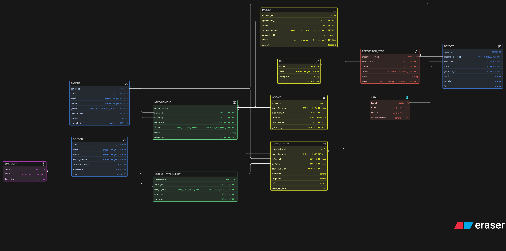

# 🏥 Clinic Management System - ER Diagram

This project presents a **detailed Entity-Relationship (ER) Diagram** for a modern clinic management system.  
It models real-world workflows including appointments, consultations, diagnostic tests, reports, and payments.

---

## 📌 Overview

The system is designed to digitally manage clinic operations such as:

- Managing doctors and their specialties  
- Handling patient records  
- Booking and tracking appointments  
- Conducting consultations  
- Prescribing and managing diagnostic tests  
- Generating reports  
- Processing payments and invoices  

This design focuses on **clarity, normalization, and real-world accuracy**.

---

## 🖼️ ER Diagram

---

## Eraser link

[Eraser Link](https://app.eraser.io/workspace/iaC9yp3a1EV9D66yFtX0)

---

## 🧩 Entities Description

### 👤 PATIENT
Stores patient information such as personal details and contact information.

---

### 👨‍⚕️ DOCTOR
Stores doctor details including license number, experience, and specialization.

---

### 🏷️ SPECIALTY
Represents medical specialties (e.g., Cardiology, Dermatology).

---

### 📅 APPOINTMENT
Handles scheduling between patients and doctors.
- Tracks booking status (booked, cancelled, completed, no-show)

---

### 🩺 CONSULTATION
Represents the actual visit after an appointment.
- Stores diagnosis, symptoms, and notes

---

### 🧪 TEST
Defines available diagnostic tests.

---

### 🔗 PRESCRIBED_TEST
Bridge entity connecting consultations and tests.
- Stores test-specific instructions, priority, and status

---

### 🏥 LAB
Represents diagnostic labs where tests are conducted.

---

### 📄 REPORT
Stores results of prescribed tests.
- Linked to both patient and lab

---

### 💳 PAYMENT
Tracks transactions related to appointments.

---

### 🧾 INVOICE
Represents billing details for appointments.

---

### ⏰ DOCTOR_AVAILABILITY
Stores available time slots for doctors.

---

## 🔗 Relationships

- A **patient** can book multiple **appointments**
- A **doctor** can attend multiple **appointments**
- An **appointment** may result in one **consultation**
- A **patient** can have multiple **consultations**
- A **doctor** performs multiple **consultations**
- A **specialty** can have multiple **doctors**
- A **consultation** can prescribe multiple **tests**
- A **test** can be prescribed in multiple **consultations**
- A **prescribed test** generates one **report**
- A **patient** can have multiple **reports**
- A **lab** generates multiple **reports**
- An **appointment** can have multiple **payments**
- An **appointment** has one **invoice**
- A **doctor** can have multiple **availability slots**

---

## 📌 Author

- Mohd Sameer

---
