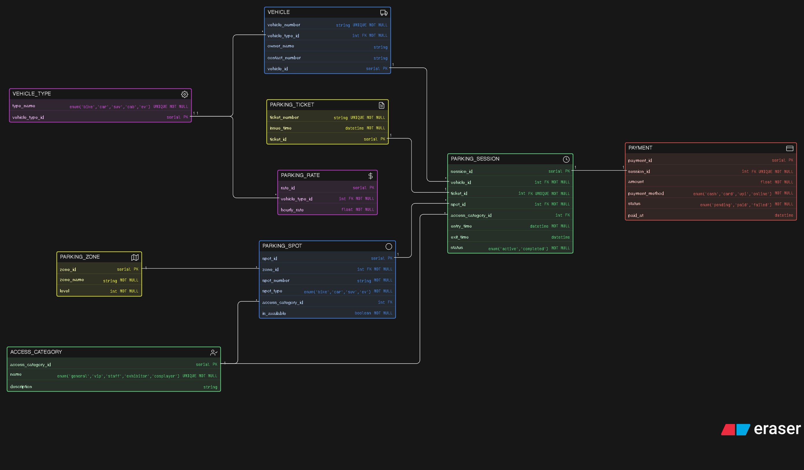

# 🚗 Comic-Con Parking Management System - ER Diagram

This project presents a **detailed Entity-Relationship (ER) Diagram** for a multi-zone parking system designed for large-scale events like Comic-Con.

The system efficiently manages vehicle entry, parking allocation, sessions, and payments across multiple zones and levels.

---

## 📌 Overview

The parking system is designed to handle:

- High volume vehicle entries (bikes, cars, SUVs, EVs, etc.)
- Structured parking zones and levels
- Reserved parking for VIPs, staff, exhibitors, and cosplayers
- Parking ticket generation
- Entry and exit tracking
- Parking fee calculation
- Payment processing

---

## 🖼️ ER Diagram

---

## Eraser Link

[Eraser Link](https://app.eraser.io/workspace/iaC9yp3a1EV9D66yFtX0)

---

## 🧩 Entities Description

### 🚗 VEHICLE
Stores vehicle details such as number, owner, and type.

---

### ⚙️ VEHICLE_TYPE
Defines categories of vehicles:
- Bike
- Car
- SUV
- Cab
- EV

---

### 🧑‍🚀 ACCESS_CATEGORY
Represents special access types:
- General
- VIP
- Staff
- Exhibitor
- Cosplayer

---

### 🗺️ PARKING_ZONE
Represents parking zones and levels within the venue.

---

### 🅿️ PARKING_SPOT
Represents individual parking spots:
- Assigned to zones
- May be reserved for specific access categories
- Tracks availability

---

### 🎫 PARKING_TICKET
Generated when a vehicle enters the parking facility.

---

### ⏱️ PARKING_SESSION
Core entity tracking:
- Entry and exit time
- Assigned parking spot
- Ticket reference
- Current status (active/completed)

---

### 💳 PAYMENT
Stores payment details for each parking session.

---

### 💰 PARKING_RATE
Defines hourly parking rates based on vehicle type.

---

## 🔗 Relationships

- A **vehicle type** can have many **vehicles**
- A **vehicle** can have multiple **parking sessions**
- A **parking ticket** is linked to exactly one **parking session**
- A **parking spot** can be used in multiple **sessions**
- A **parking zone** contains multiple **parking spots**
- An **access category** can be assigned to spots and sessions
- A **parking session** results in one **payment**
- A **vehicle type** defines pricing via **parking rate**

---

## 📌 Author

- Mohd Sameer

---
