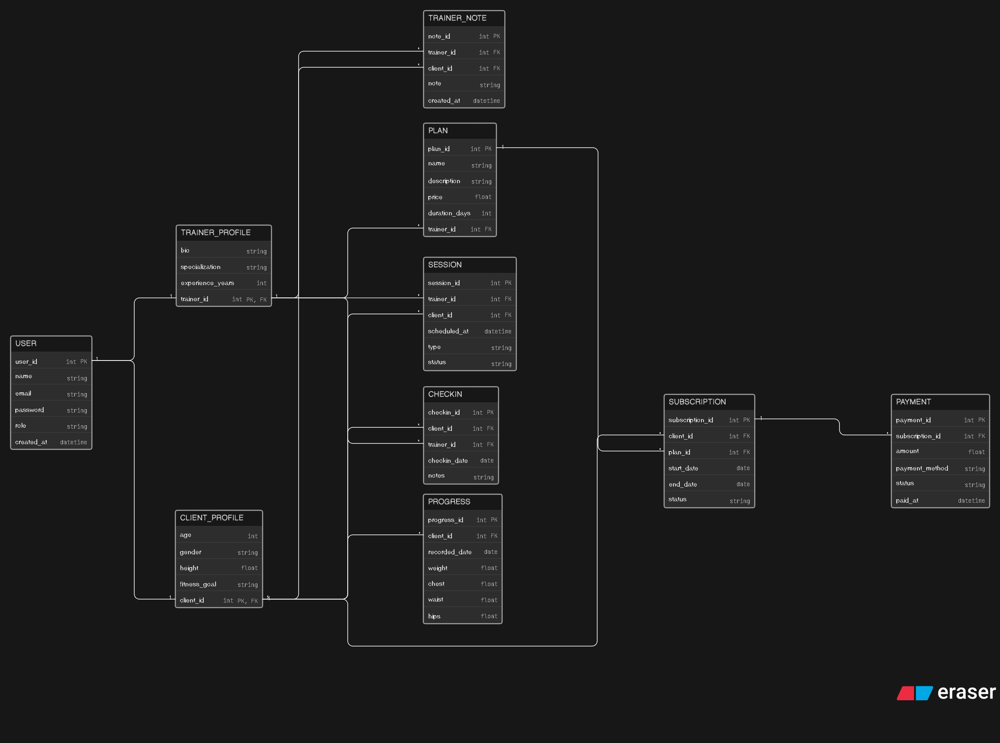

# 🏋️‍♂️ Online Fitness Coaching Platform - ER Diagram

This project represents the **Entity-Relationship (ER) Diagram** for an online fitness coaching platform where trainers manage clients, provide coaching plans, track progress, and handle subscriptions.

---

## 📌 Overview

The system is designed for a fitness influencer or trainer who offers:

- Online coaching programs
- Personal consultations
- Subscription-based plans
- Client progress tracking
- Regular check-ins and feedback

This is **not a gym management system**, but a **digital coaching ecosystem**.

---

## 🖼️ ER Diagram

---

## 🖼️ Eraser Link

[Eraser link](https://app.eraser.io/workspace/iaC9yp3a1EV9D66yFtX0)

---

## 🧩 Entities and Description

### 👤 USER
Stores basic information for all users.
- Can be either a **trainer** or a **client**

---

### 🧑‍🏫 TRAINER_PROFILE
Stores trainer-specific details:
- Bio
- Specialization
- Experience

---

### 🧑 CLIENT_PROFILE
Stores client-specific details:
- Age, gender, height
- Fitness goals

---

### 📋 PLAN
Represents coaching programs created by trainers.
- Includes pricing and duration

---

### 📦 SUBSCRIPTION
Tracks which client purchased which plan.
- Includes start date, end date, and status

---

### 📅 SESSION
Represents scheduled interactions:
- Consultation or live session
- Between trainer and client

---

### 📝 CHECKIN
Client updates submitted periodically.
- Used for monitoring consistency and progress

---

### 📊 PROGRESS
Stores measurable fitness data:
- Weight
- Body measurements

---

### 📓 TRAINER_NOTE
Trainer feedback for clients:
- Personalized guidance and observations

---

### 💳 PAYMENT
Handles financial transactions:
- Linked to subscriptions
- Tracks payment method and status

---

## 🔗 Relationships

- A **User** can be a **Trainer** or **Client** (1:1)
- A **Trainer** can create multiple **Plans** (1:M)
- A **Client** can subscribe to multiple **Plans** (M:N via Subscription)
- A **Plan** can have multiple **Subscribers**
- A **Trainer** can conduct many **Sessions**
- A **Client** can attend many **Sessions**
- A **Client** submits multiple **Check-ins**
- A **Trainer** reviews multiple **Check-ins**
- A **Client** has multiple **Progress records**
- A **Trainer** writes multiple **Notes** for clients
- A **Subscription** can have multiple **Payments**

---

## 📌 Author

- Mohd Sameer

---
