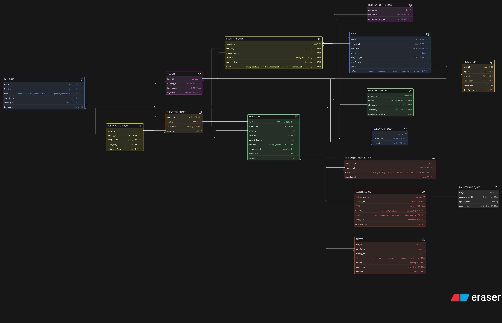

# 🛗 LiftGrid Smart Elevator Control System - ER Diagram

This project presents a **production-level Entity-Relationship (ER) Diagram** for a smart elevator control platform designed for large-scale infrastructure such as corporate towers, malls, airports, hospitals, and high-rise residential buildings.

---

## 📌 Overview

The system models a **multi-building elevator management platform** that handles:

- Multiple buildings and floors  
- Elevator grouping and zoning  
- Real-time floor requests  
- Smart ride allocation  
- Multi-stop ride execution  
- Elevator status tracking  
- Maintenance and alert systems  
- Historical ride and performance logging  

This design ensures **scalability, reliability, and real-world operational accuracy**.

---

## 🖼️ ER Diagram

---
## Eraser Link

[Eraser Link](https://app.eraser.io/workspace/iaC9yp3a1EV9D66yFtX0)

---

## 🧩 Entities Description

### 🏢 BUILDING
Represents physical buildings connected to the platform.
- Stores location, type, and total floors

---

### 🧱 FLOOR
Defines floors within a building.
- Ensures unique floor numbering per building
- Tracks active/inactive floors

---

### 🧩 ELEVATOR_GROUP
Groups elevators into zones (e.g., low-rise, high-rise).
- Improves efficiency in high-rise buildings

---

### 🏗️ ELEVATOR_SHAFT
Physical shaft where an elevator operates.
- Each shaft contains exactly one elevator

---

### 🛗 ELEVATOR
Core entity representing each elevator.
- Stores capacity, direction, and operational state

---

### 🔄 ELEVATOR_FLOOR
Bridge table for many-to-many relationship:
- One elevator serves multiple floors  
- One floor can be served by multiple elevators  

---

### 📊 ELEVATOR_STATUS_LOG
Tracks real-time and historical status:
- Idle, moving, stopped, maintenance, etc.

---

### 📡 FLOOR_REQUEST
Represents user-generated requests from floors.
- Tracks direction and request status

---

### 📍 DESTINATION_REQUEST
Stores destination floors for a request.
- Supports multiple passengers with different destinations

---

### 🔗 RIDE_ASSIGNMENT
Assigns a request to an elevator.
- Stores allocation strategy (nearest, least load, etc.)

---

### 🚀 RIDE
Represents actual elevator trips.
- Tracks start/end time and ride status

---

### ⏸️ RIDE_STOP
Tracks intermediate stops during a ride.
- Maintains stop order and timing

---

### 🛠️ MAINTENANCE
Stores maintenance records for elevators.
- Tracks issues, severity, and status

---

### 📝 MAINTENANCE_LOG
Maintains detailed updates for each maintenance activity.

---

### 🚨 ALERT
Handles system alerts:
- Overload, failure, emergency, delays

---

## 🔗 Relationships

- A **building** contains multiple floors, elevators, shafts, and groups  
- A **shaft** contains exactly one elevator  
- An **elevator** belongs to a building and may belong to a group  
- An **elevator** serves multiple floors (many-to-many via `ELEVATOR_FLOOR`)  
- A **floor request** originates from a floor  
- A **request** can have multiple destination floors  
- A **request** is assigned to exactly one elevator  
- An **elevator** completes multiple rides  
- A **ride** consists of multiple stops  
- An **elevator** has multiple status logs  
- An **elevator** can have multiple maintenance records  
- A **maintenance record** can have multiple logs  
- Alerts can be generated for both elevators and buildings   

---

## 📌 Author

- Mohd Sameer

---
